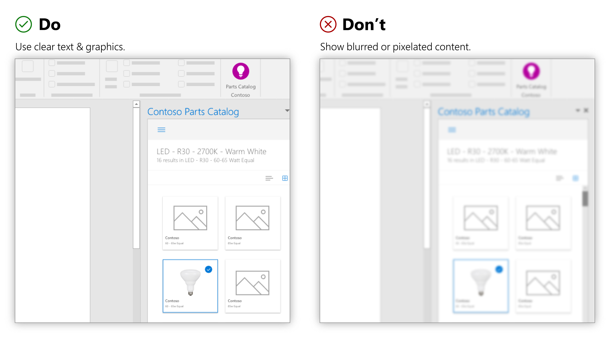
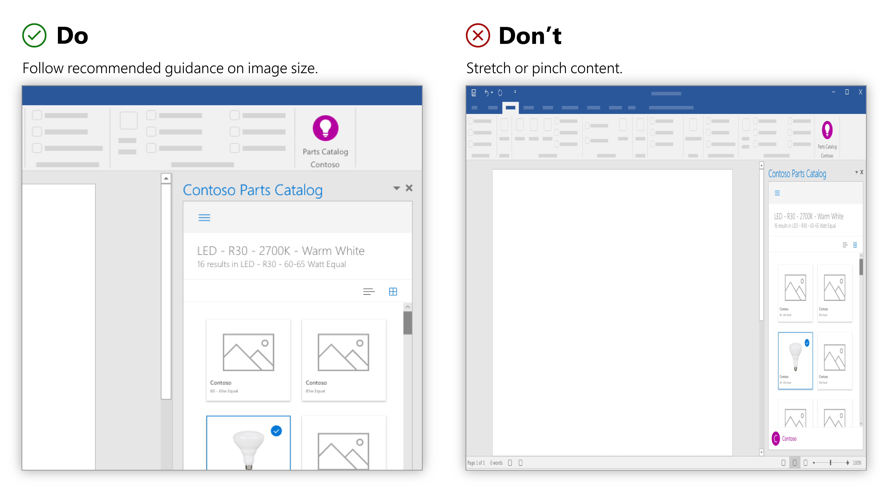
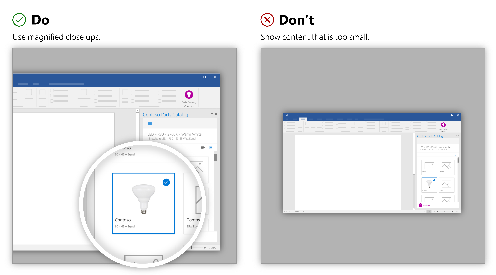
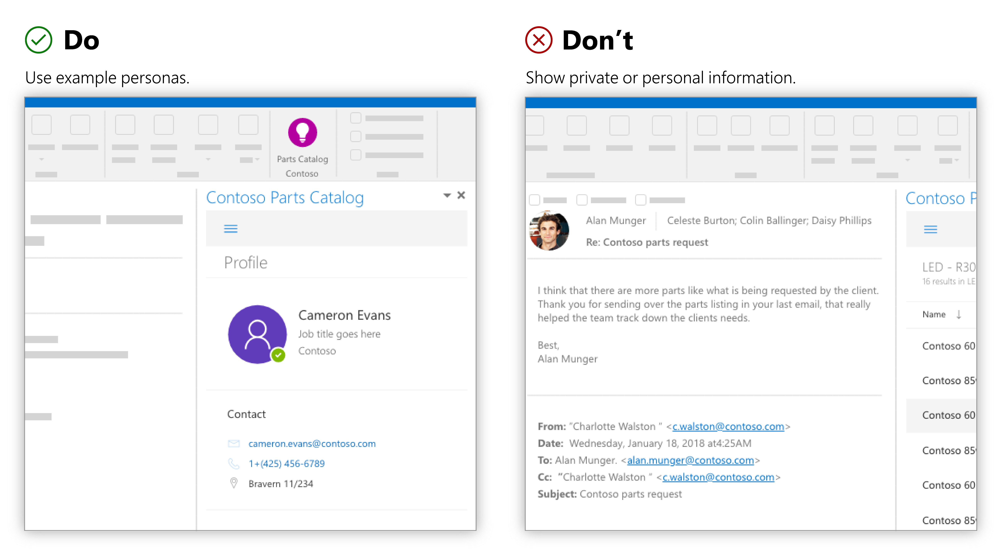
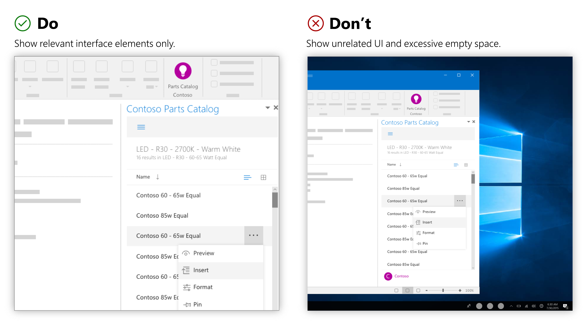
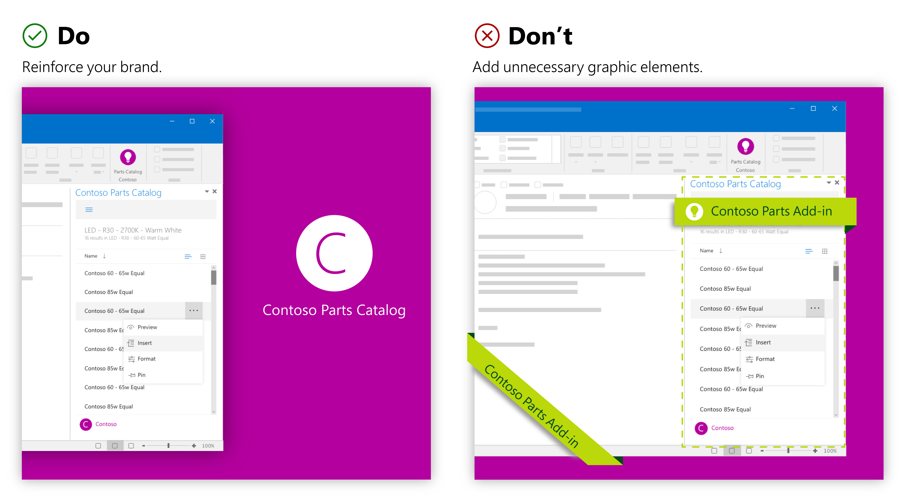
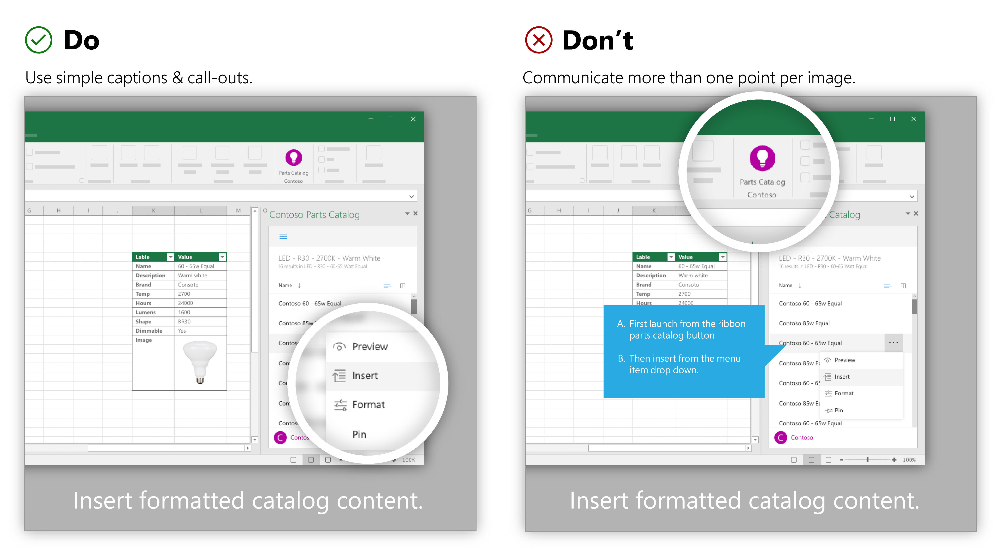
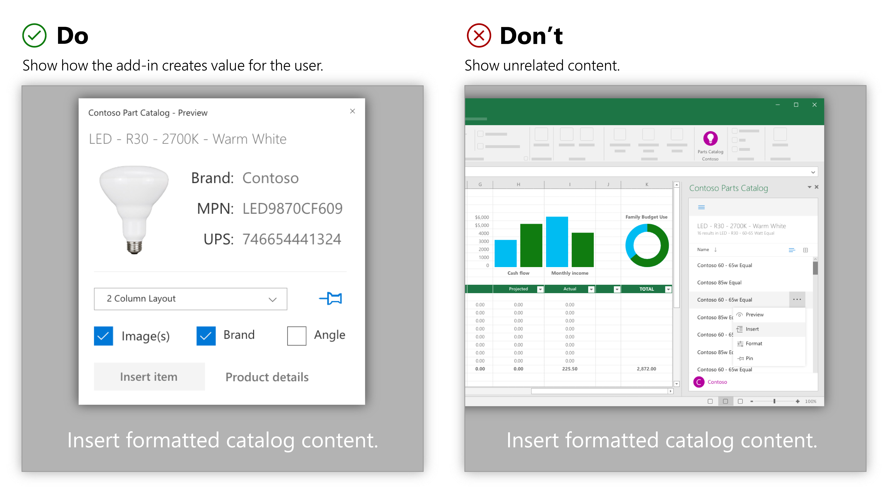
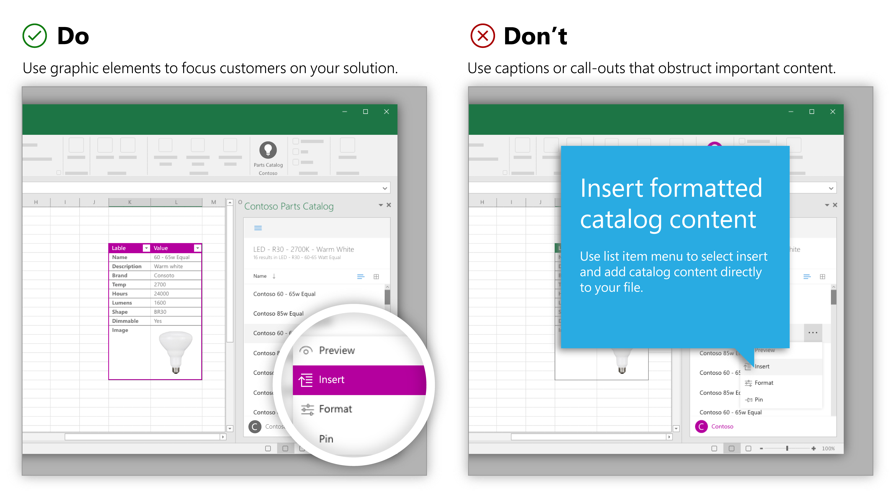

# Craft effective AppSource store images

Each AppSource listing contains images that inform the user and promote the add-in. AppSource images provide users with a quick overview of features and enhance their understanding of the add-in’s value. To create the best images for your AppSource listing, we recommend that you apply the following the guidelines.

## Make images legible

The content of each image should be easy to read, and should reflect the quality of your solution. Users should be able to clearly view image content and read captions at a glance.

|**Do**|**Don't**|
|:----|:----|
|Use clear text and graphics with the [appropriate contrast ratios](https://docs.microsoft.com/en-us/windows/uwp/design/accessibility/accessible-text-requirements#contrast-ratios).| Don’t show blurred, pixelated, or poorly rendered text or graphics.
|Provide at least one image that is 1366w x 768h pixels and no greater than 1024 KB.  | Don't stretch or pinch your images (poor aspect ratio).
|Use magnified close-ups or crops when needed to make content legible.|Don’t make your content so small that it is illegible.|

## Avoid excess content
Use images to focus the user’s attention on your solution. Images that contain unrelated content are distracting and confusing to the user. 

|**Do**|**Don't**|
|:----|:----|
|Use example personas when needed.|Don't show private or personal information.|
|Only show interface elements relevant to the add-in. Use the Office UI sparingly. |Don’t show unrelated user interface elements such as task bars, ribbons, excessive empty space, or other applications.|
|Reinforce your brand by incorporating recognizable brand elements such as the logo or brand colors. | Don’t add unnecessary graphic elements that obstruct content. |

## Show the value of your add-in
The images should clearly communicate value of your solution and its main features. Focus each image on communicating one piece of information. Users will glance only briefly at each image. Show how your solution will be used. Show core value with clear illustrations.

|**Do**|**Don't**|
|:----|:----|
|Use simple captions or callouts to focus the user’s attention on one key feature.|Don’t communicate more than one point per image.|
|Only show content that helps illustrate how the add-in creates value for the user.| Don’t show unrelated content.|
|Position callouts, magnifications, or crops to focus customers on your solution.| Don’t use captions or callouts that obstruct important content.|

## See also
* [AppSource validation policies](https://docs.microsoft.com/en-us/office/dev/store/validation-policies)
* [Create effective AppSource listings](https://docs.microsoft.com/en-us/office/dev/store/create-effective-office-store-listings)
