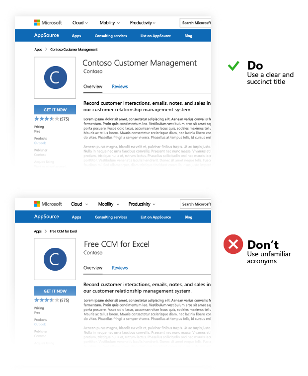
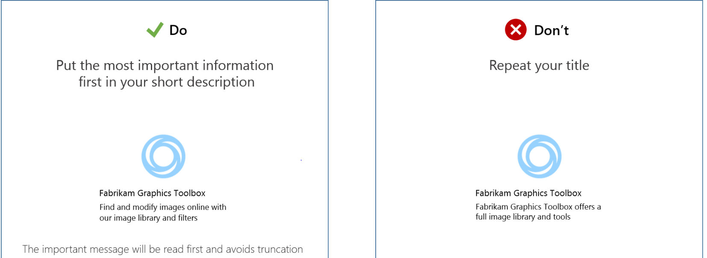
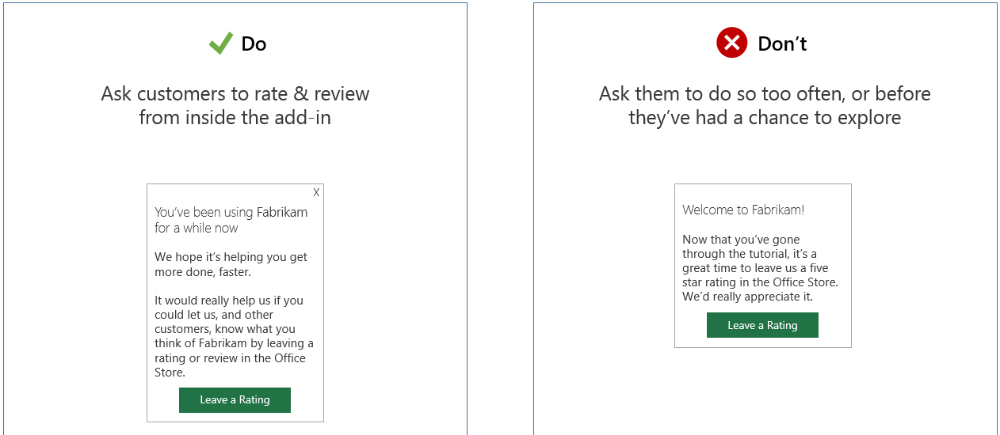

# Create effective listings in AppSource and within Office

The information and images that you submit to the Seller Dashboard become the AppSource and in-product Store listing for your solution. This information is the first thing prospective users see, and creates their first impression. Make sure that the information you submit—including your title, description, logos, and images—clearly communicates the benefits and functionality that your solution provides.

Apply the following when you create your title, description, and images:

- Describe what your solution can do for customers. Answer the question: *What problem does this solution solve?* 
- Use unique logos for each submission.
- Include images that show off your UI. Be sure to remove any personal information from your images.
- If you update your functionality, update your description too.
- Use a customer-friendly voice. Be concise and use natural language.
- Avoid marketing speak and buzz words.
- Check the spelling and grammar in your titles and descriptions.

## Use a succinct and descriptive title

Create a simple and direct title. The shorter the title the better. Remember, the length of the title that is displayed can depend on how the user sizes the window. Include your brand or company name if users are likely to use it to search for your solution.

In your title:

- Make the purpose or benefits of your solution clear. Don't rely on your brand to communicate what your solution does. 
- Use the following naming pattern: Function + for + brand or company name (optional). For example, Small Business Invoicing for Contoso.
- Use title case. Capitalize the first letter of each word, except articles and prepositions. For example, Apartment Search for Contoso.
- Don't include the Microsoft product name. This appears on your landing page, and in AppSource and in-product Store search results.
- Avoid acronyms that might be unfamiliar to potential users. 
- Don't use all uppercase letters, unless your brand name is all uppercase.
- Don't use the words "free" or "sale" or include exclamation points.

*Figure 1. An AppSource listing with an effective title and description next to one that is less effective*

### Use a consistent add-in name

You specify your add-in name in two places, so be sure to use the same name in both:

- Your add-in manifest; specifically, the [DisplayName element](http://msdn.microsoft.com/library/529159ca-53bf-efcf-c245-e572dab0ef57%28Office.15%29.aspx) element (Office Add-in), or the [Title element](http://msdn.microsoft.com/library/c4ca4165-ed3a-7ded-d8e3-0a841955d109%28Office.15%29.aspx) element (SharePoint Add-in). This specifies the name that is displayed after the user installs the add-in.
- The Seller Dashboard add-in submission form. This specifies the name that is displayed in AppSource and the in-product Store.

## Write compelling descriptions

A good description makes your solution stand out. Your short description should entice potential users to learn more. Your long description, which appears on the AppSource landing page, should provide more detail about your solution and its value.

### Effective short descriptions

The short description that you supply with your submission is the text that is shown to users in AppSource and in-product search results. You want it to be original, engaging, and directed at your target audience. Describe your solution and its value to your target customer, in one or two sentences:

- Put the most important information first.
- Do not repeat the title.
- Avoid using jargon or specialized terminology; don't assume that users know what they're looking for.
- Include keywords that customers might search for.

*Figure 2. A good short description next to one that relies on the brand name*

### Effective long descriptions

The long description is displayed on your landing page in AppSource and within Office. It should match the description in your manifest as closely as possible. You have room for a more detailed description, including the main features, the problems it solves, and the target audience for your solution. Be sure to include popular search keywords. The Office.com search engine will pick these up in search query return sets.

In your long description, answer the following questions:

- How does your solution benefit its user?
- What is special about it?
- What are different ways someone could use your it?
- What industries or specialists would use it?

Most users read between 300 and 500 words. The maximum length for long descriptions is 4,000 characters.

You might want to list features to aid readers scanning your description. To create a bulleted list in the Seller Dashboard, use the following formatting: 

Features:

[#LI] First feature[/#LI]

[#LI] Second feature[/#LI]

## Apply guidelines for title and description length

|**Item**|**Maximum length**|**Recommended length**|**Include key message in the...**|
|:-----|:-----|:-----|:-----|
|Title|50 characters|30 characters|First 30 characters|
|Short description|100 characters|70 characters|First 30 characters|
|Long description|4,000 characters|300-500 characters|First 300 characters|

## Create a consistent visual identity 

Your name and description can be powerful tools to draw in potential customers. You also want to present a unified visual identity for your solution. The logo you use is important. Two files represent your logo. To present a consistent logo, both images should be of the same logo or icon. This way, the user sees the same logo in AppSource and when the solution is displayed in Office or SharePoint. The two images have different formatting requirements.

Your logo should:

- Convey how your solution helps the customer get work done.
- Use simple imagery. Don't clutter or complicate your image.
- Communicate the problem that the solution solves. Don't rely on your company logo for your image.

*Figure 3. A clear logo with an Excel chart next to an unclear Fabrikam logo*

When you submit Office Add-ins, you specify an image in your manifest file, and upload an image with your Seller Dashboard submission.

For SharePoint Add-ins, you include an image in your add-in package, and upload an image with your Seller Dashboard submission. These two images have to match for your add-in to validate.

### Create an icon for your add-in

For Office Add-ins that you are submitting to AppSource, you have to link to an image by using the [IconUrl element](http://msdn.microsoft.com/library/c7dac2d4-4fda-6fc7-3774-49f02b2d3e1e%28Office.15%29.aspx) in the manifest. This image represents your add-in within an Office application.

The formatting requirements for this image differ depending on the add-in type. The following table lists the requirements for the icon image, by add-in type.

||**Outlook add-ins**|**Task pane and content add-ins**|
|:-----|:-----|:-----|
|Accepted formats|.bmp, .gif, .exif, .jpg, .png, and .tiff|.bmp, .gif, .exif, .jpg, .png, and .tiff|
|Source location|The image specified must be secured with HTTPS.|The image specified does not have to be secured with HTTPS.|
|Size|For best appearance, make your icon 64 x 64 pixels. There is no specific size limit, but Outlook will resize the icon to 64 x 64 if necessary. This might result in a less-than-optimal icon display. |Must be 32 x 32 pixels.|
|Display location|Exchange Administration Center|Office client interface. The Insertion dialog, MRU list, or context box.|
|Localization| [IconUrl element](http://msdn.microsoft.com/library/c7dac2d4-4fda-6fc7-3774-49f02b2d3e1e%28Office.15%29.aspx) supports culture-specific images in the manifest.| [IconUrl element](http://msdn.microsoft.com/library/c7dac2d4-4fda-6fc7-3774-49f02b2d3e1e%28Office.15%29.aspx) supports culture-specific images in the manifest.|

For SharePoint Add-ins, you have to include an icon in the add-in's package. The image must be 96x 96 pixels. You must also specify this image when you submit your add-in through the Seller Dashboard.

## Use images effectively

Make your store images rich and informative. Help customers understand how your solution solves problems. Make it clear at a glance. Follow our best practices for [crafting effective AppSource store images](insert link to new page here). Remember to communicate only the essential. In your images:

- Keep images legible. 
- Show real content rather than an empty document.
- Focus on your soltuion.
- Use captions to describe features and value.
- Reinforce your brand.

> [!NOTE]
> Be sure to remove any personal information from your images that you do not want customers to see.

 

|**Do**|**Don't**|
|:------------|:--------------|
|**Use clear and simple captions to convey your add-in's value.**|**Don’t use callouts that obstruct important content.**|
| | |
|**When needed, make content legible with magnified close-ups.**|**Don't highlight more than one section.**|
|||
|**Incorporate recognizable brand elements like color or logo into images.**|**Don't add unnecessary graphic elements that obstruct content.**|
|||

 

## Use ratings and reviews

Good ratings and reviews lead to better store placement and improved customer perception of your product. Customers also use reviews as a forum to offer feedback and suggestions, particularly if feedback and support options are not available within the app or add-in. Be sure to:

- Ask customers to rate and review from within your add-in. Make sure that they've had a chance to explore the add-in first, and don't ask for feedback too often.
- Offer help and support from within your add-in, so customers don't have to leave feedback in AppSource reviews.

*Figure 4. A request to rate within an add-in next to a request to rate following a tutorial*

## Respond to customer reviews in AppSource

You can use the comment feature in AppSource to respond to customer reviews of your solution; for example, customer reviews that indicate that a user had trouble with installation, was confused about features or functionality, or had compatibility issues. If you're signed in to AppSource with the same account that you used to submit your app or add-in via the Seller Dashboard, your response to the customer review will be tagged with an "App provider" label.

*Figure 5. A developer response to a comment with the App provider label under the name*

 
If you've responded to a user review and the user responds to your comment, the user has the option to change their rating of the app or add-in if their issue has been resolved. 

Responding directly to your customers increases your customer engagement and enables you to:

- Help users with installation or other issues that can prompt negative reviews.
- [Troubleshoot](http://msdn.microsoft.com/library/4e3a5129-5bb8-4aed-b122-200c6410d82c%28Office.15%29.aspx) issues and provide technical support to your users.
- Encourage users to edit their rating when their issue is resolved, improving your global ratings over time.
- Connect with your customers and discover what features to build, and why.
- Indicate to users that their feedback is important and is monitored.
- Reduce future negative reviews and comments.

## Create effective ad-supported apps and add-ins

If you're creating ad-supported apps or add-ins, apply the following guidelines:

- Consider user experience versus revenue. Many businesses do not accept ads and pay for the apps they use. Smaller businesses and individuals might be willing to install ad-supported apps or add-ins.
- Ads should not obstruct content or functionality. Do not use ads that overlay content, pop up new windows, or push functionality off-screen on a 1024 x 768 pixel browser window size.
- Avoid sound- and video-based ads.
- Differentiate ads from content and functionality. For example:
    - Display small print in the region of the screen that shows the ad. 
    - Use a different background color or font style for the ad content.
    - Use special border treatments around the ad.
    - Use a layout placement away from regular content.
- Do not include ads with inappropriate content. Ads are subject to the same policies that the content in apps and add-ins is. 
- Use a standard size and location for ads.

## See also

- [Use the Seller Dashboard to submit your solution to AppSource](use-the-seller-dashboard-to-submit-to-the-office-store.md)
- [Validation policies](validation-policies.md)
- [Make your solutions available in AppSource and within Office](submit-to-the-office-store.md)
